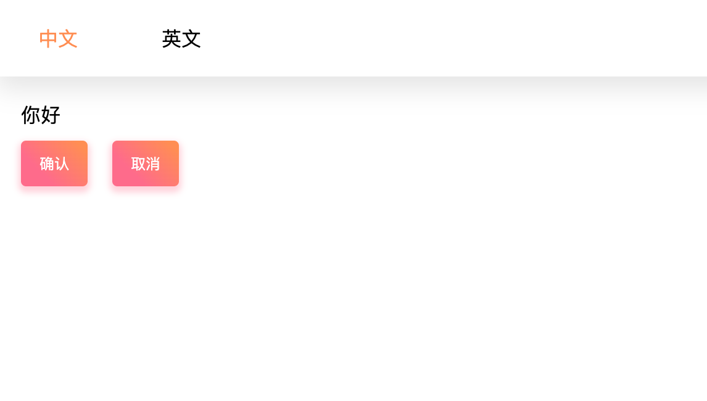

[English](./README.md) | 简体中文

# mobx-react-i18n
利用 mobx 实现国际化



* * *

-   [安装](#安装)
-   [指南](#指南)
-   [API](#api)

## 安装

```sh
npm install --save mobx-react-i18n
```

## 指南

1. 创建国际化资源文件 `zh-CN.json`, `en-US.json`:
```json
{
    "CHINESE": "中文",
    "ENGLISH": "英文",
    "greeting": "你好",
    "btn": {
        "confirm": "确认",
        "cancel": "取消"
    }
}
```

2. 通过 Provider 将国际化全局状态注入到应用中
```js
import { Provider } from "mobx-react";
import {LanguageStore} from 'mobx-react-i18n';

const languageStore = new LanguageStore({
    currentLanguage: 'zh-CN',
    languageMap: {
        'zh-CN': require('./i18n/zh-CN.json'),
        'en-US': require('./i18n/en-US.json')
    }
});

ReactDOM.render((
    <Provider language={languageStore}>
        <App />
    </Provider>
), document.getElementById("app"));
```

3. 使用 `<Language />` 来转换字符串文本:
```js
import { Language } from 'mobx-react-i18n';

const Greeting = () => (
    <p><Language resource="greeting"/></p>
)
```

## API
-   [Language](#Language)
-   [LanguageStore](#LanguageStore)

### Language
`<Language />` 渲染国际化文本.

#### Parameters
-   `props`
    -   `props.resource` 国际化文件中的 key.

### LanguageStore
用来生成国际化全局状态的 Store
#### Parameters
-   `options`
    -   `options.currentLanguage` 设置默认语言
    -   `options.languageMap` 所需的国际化资源文件集
-   `property`
    -   `language.currentLanguage` 当前语言
-   `method`
    -   `language.changeLanguageTo` 切换语言